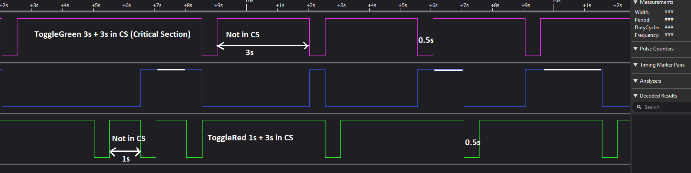

### Periodic Multitasking

**Project description**

The project comes from J. Cooling (1017), from his book *Real-time Operating Systems*. The challenge is to create a two task multitasking application (toggleGreen and toggleRed tasks). toggleGreen must work for 3s this is simulated by doing SET on the green LED, then it must RESET the LED for 0.5s. The toggleRed must SET the red LED for 1s, then set it on RESET for 0.5s. During the SET modes tasks compete for share_function. This function emulates the critical region. 

**Components**
- STM32 Microcontroller. Set up using an RTOS (e.g., FreeRTOS).
- Three different color LEDs connected to GPIO pins of the STM32. 
- Two Tasks. Each task controls the blinking of one LED.
- When the tasks compete for a critical region the blue LED is set ON. 

**Task behavior**
*ToggleGreen*:
- At startup, it must toggle ON the green LED. 
- During a period of 3s, it will emulate doing work by calling HAL_Delay
- It will try to acquire share_function
- It will turn OFF the green LED.
- During a period of 0.5s, it will do nothing
 
*ToggleRedTask* :
- At startup, it must toggle ON the green LED. 
- During a period of 1s, it will emulate doing work by calling HAL_Delay
- It will try to acquire share_function
- It will turn OFF the green LED.
- During a period of 0.5s, it will do nothing

This solution uses **timers** to create keep tasks in execution before yielding control. See
- [specification](https://github.com/ahiralesc/RTOS/blob/main/F767ZIT6/2_Synchronization/Task_mgmt_PPM_Delay_F7/Sync_contention_F7.pdf) for CubeMX settup. 
- And ```src/main.c``` for solution.



Fig. 1 Illustrates ToggleGreenTask and ToggleRedTask timing constraints are incorrect. Try explaining what is wrong. 

