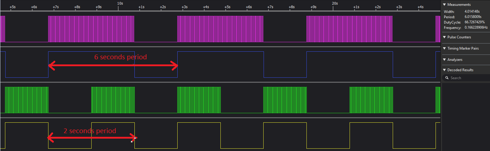
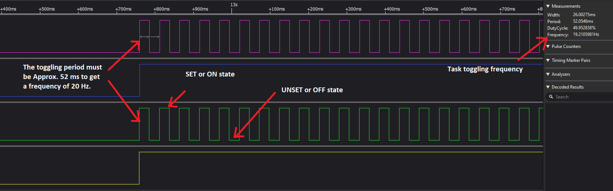

### Periodic Multitasking

**Project description**

The project comes from J. Cooling (1017), from his book *Real-time Operating Systems*. The challenge is to create a two task multitasking application. Tasks must be periodic and perform work at a frequency of 20Hz. Thus, the main challenges are to ensure that periodic tasks starting deadlines are met and that work is performed at the specified frequency. Work is emulated by toggling LEDs on and off.  

**Components**
- STM32 Microcontroller. Set up using an RTOS (e.g., FreeRTOS).
- Four different color LEDs connected to GPIO pins of the STM32. 
- Two periodic Tasks. Each task controls the blinking of two LEDs.

**Task behavior**
*ToggleGreenTask* must execute periodically every 6s:
- At startup, it must toggle ON the blue LED. 
- During a period of 4s, it must toggle the green LED on/off at a frequency of 20Hz. 
- At completion, it must toggle OFF the blue LED. 

*ToggleRedTask* must execute periodically every 2s:
- At startup, it must toggle ON the yellow LED.
- During a period of 2s, it must toggle the red LED on/off at a frequency of 20Hz.
- At completion, it must toggle OFF the yellow LED. 

This solution uses **timers** to create keep tasks in execution before yielding control. See
- [specification](https://github.com/ahiralesc/RTOS/blob/main/F767ZIT6/2_Synchronization/Task_mgmt_PPM_Delay_F7/Task_mgmt_PPM_Delay_F7.pdf) for CubeMX settup. 
- And ```src/main.c``` for solution.



Fig. 1 Illustrates ToggleGreenTask and ToggleRedTask periods are correct. 



Fig. 2 Illustrates that toggling frequency is nearly correct (19.2 Hz).  