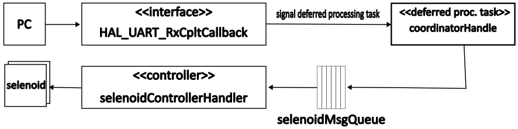

## UART Command Handler

### Introduction

The solution is based on the **mediator pattern**. The mediator (coordinator) manages communication between various components (e.g., the producer and consumer) to reduce direct dependencies. It ensures that the producer and consumer do not interact with each other directly. This approach demonstrates how to manage serial input commands via UART, effectively separating UART communication from processing logic, thereby making the system more modular and promoting loose coupling.

The responsibilities of the components are as follows:
- **Producer task** (HAL_UART_RxCpltCallback): Reads incoming control messages from UART and defers further processing to the coordinator task (coordinatorHandler). This scheme, known as deferred processing, keeps the ISR (Interrupt Service Routine) brief, ensuring its execution time remains predictable. For simplicity, each incoming control message is a fixed-length JSON format.
- **Coordinator task** (coordinatorHandler): Initially blocks and waits for ```HAL_UART_RxCpltCallback``` to signal the arrival of a new control message. Once unblocked, it validates that the control message is JSON-formatted, determines the target controller, and prepares a control message for that device. The message is then forwarded to the corresponding device queue, such as solenoidQueue or pumpQueue. In this example, only a single queue, the solenoidQueue whish is really used to control LEDs, is implemente
- **Consumer task** (solenoidControllerHandler): Continuously dequeues control messages from its queue (solenoidQueueHandle) and executes each command in a persistent task. This implementation is not very efficient, as it serves as a proof of concept. Consider optimizing it for production use. 

### Use case

The application of this pattern is demonstrated through the construction of an irrigation system. Only one use case is discussed: As a user, I want to specify the selenoid, frequency, and duration of irrigation to control the soil moisture for each plant in a selected selenoid location. An LED emulates a solenoid that serves as a control valve for water flow. Three LEDs are used to represent three locations in the garden. Other devices that can be controlled include pumps and/or humidity sensors. The control message follows this format:

```Python
{
	"cmd" 		: 	"00",	# The I/O device type.
	"id"		:	"01",	# The sub-device ID i.e. LED
	"frequency"	:	"50",	# The device frequency 20 Hz
	"duration"	:	"01"	# The device period in seconds
}
```

An example control message is {"id":01,"frequency":30,"duration":01}. The UART requires a buffer size of 55 bytes: 54 bytes for the JSON string, plus 1 byte for the "\x0" character, which is typically used to terminate the string. Since LEDs are used instead of solenoids, the toggling (flickering) frequency must range between 30 and 60 Hz. Beyond 60 Hz, the flickering typically appears as continuous, stable light to the human eye. In a drip irrigation system, water is supplied at much lower rates, usually measured in drops per second or liters per hour.

### Processing workflow

<br>
<center>Fig. 1 Collaborative diagram of the monitor pattern.</center> 

### Comments

The message queue (msgQueueHandle) stores incoming integer values by value. This approach helps avoid race conditions between the producer and consumer tasks. However, one drawback is that the tasks are not synchronized, meaning the consumer task doesn't immediately know when a new message has arrived. Since the consumer task blocks on the read operation and runs persistently (continuously executing), this lack of synchronization doesn't cause functional issues. However, it comes at the cost of increased power consumption.

### Additional resources

- FreeRTOS [CoreJSON](https://github.com/FreeRTOS/coreJSON/tree/b92c8cd9cdba790e46eab05f7a620b0f15c5be69) repository.